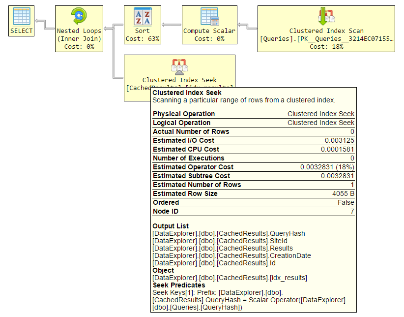

# html-query-plan

html-query-plan is a JavaScript library for showing Microsoft SQL Server execution plans in HTML.



To use in a web page:

 - Find the latest release [here](https://github.com/JustinPealing/html-query-plan/releases/latest).
 - Include `qp.css` and `qp.min.js`
 - Call `QP.showPlan`, passing the container in which to show the plan and the query plan XML (as a string). 

```
<div id="container"></div>
<script>
    QP.showPlan(document.getElementById("container"), '<ShowPlanXML...');
</script> 
```

See the `examples` folder for complete examples.

## Options

Additional options can be passed using the 3rd argument:

```
<div id="container"></div>
<script>
    var options = {
        jsTooltips: false
    };
    QP.showPlan(document.getElementById("container"), '<ShowPlanXML...', options);
</script> 
```

| Option | Default | Description | 
| --- | --- | --- | 
| jsTooltips | true | Set to `false` to use CSS tooltips. | 

## Running XSLT separately

Under the covers, html-query-plan is an XSLT 1.0 stylesheet (`qp.xslt`), which can be used to pre-render the plan html. Javascript is still needed to draw the connecting lines. To do this, follow the above steps but call `QP.drawLines` instead:

```
<div id="container">
    <!-- Insert XSLT output here -->
</div>
<script>
    QP.drawLines(document.getElementById("container"));
</script>
```

## Browser Support

Should work just fine in any modern browser. Tested in Chrome, Firefox and IE9+. IE8 and earlier have known issues.

## Icons

Meaning of the "overlay" icons for nodes:

| Icon | Description | 
| --- | --- | 
|  | Either the actual execution mode was "Batch" (for actual execution plans), or the estimated execution mode was "Batch" (for estimated plans). | 
|  | The node was executed in parallel. |
|  | There are one or more warnings on the node. |

All icons are adapted from the Fat Cow "Farm Fresh" web icons pack, which can be found at http://www.fatcow.com/free-icons.

## Building

Run the following commands in bash to output minified and unminified versions in the `dist` folder:

    npm run webpack && NODE_ENV=production npm run webpack
    
# Sponsor

A big thankyou to [Brent Ozar Unlimited](https://www.brentozar.com/) (who make [Paste The Plan](https://www.brentozar.com/pastetheplan/)) for sponsoring development of html-query-plan.
